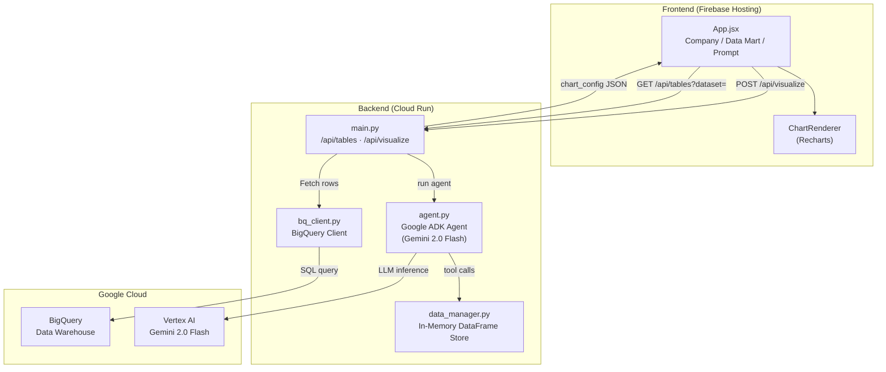
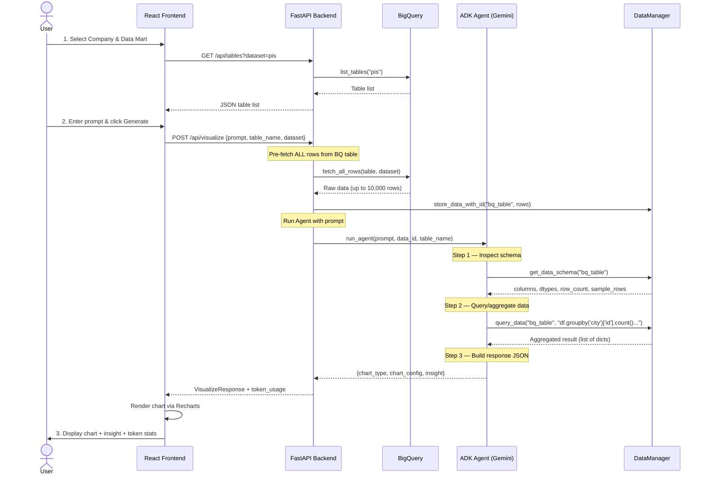

# Prompt-to-Visualization


> **AI-powered data visualization generator** — ask a question about your data in natural language and get an interactive chart with AI insights, powered by Google Gemini and BigQuery.

---

## Summary

Prompt-to-Visualization is an internal tool that enables business users to generate data visualizations from BigQuery data warehouses using natural language prompts. Users select a **company** (dataset) and a **data mart** (table), type a question like *"Show me the city with the most customers"*, and the system produces a chart with an AI-generated insight — no SQL knowledge required.

The system uses a **Google ADK agent** (Gemini 2.0 Flash) that autonomously inspects schemas, writes pandas queries, and returns structured chart configurations which the React frontend renders via Recharts.

---

## Goals

| # | Goal | Description |
|---|------|-------------|
| 1 | **Democratize data access** | Allow non-technical users to explore BigQuery data without writing SQL. |
| 2 | **Instant visual insights** | Turn natural language questions into production-quality charts and AI observations. |
| 3 | **Multi-company support** | Dynamically query different company datasets (PIS, IGR, Kingpack) from a single interface. |
| 4 | **Token efficiency** | Agent inspects schema first and fetches only the columns it needs, minimizing token usage and API costs. |
| 5 | **Simple deployment** | Single FastAPI backend + Vite React frontend, no complex infrastructure. |

---

## Architecture



---

## Application Flow

The end-to-end flow from user interaction to chart rendering follows these steps:



### Step-by-Step Breakdown

1. **User selects Company** → frontend calls `GET /api/tables?dataset=<company>` → backend queries BigQuery to list all tables.

2. **User selects Data Mart** → a specific BigQuery table is selected (e.g., `master_customer`).

3. **User types a prompt** → e.g., *"Show me the city that has the most customers"*.

4. **Frontend sends request** → `POST /api/visualize` with `{prompt, table_name, dataset}`.

5. **Backend pre-fetches data** → Loads all rows from the selected BigQuery table into an in-memory pandas DataFrame via `DataManager`.

6. **Agent runs** → The Google ADK agent (Gemini 2.0 Flash) processes the prompt using function-calling tools:
   - `get_data_schema` → Inspect column names, types, and sample data.
   - `query_data` → Execute pandas operations (groupby, filter, sort) on the DataFrame.
   - Returns a structured JSON response with `chart_type`, `chart_config` (data + labels), and `insight`.

7. **Frontend renders** → `ChartRenderer` uses Recharts to display the chart. Token usage (input, completion, agent turns) is displayed below.

---

## Tech Stack

| Layer | Technology | Purpose |
|-------|-----------|---------|
| **Frontend** | React 18 + Vite | UI framework & dev server |
| **Charts** | Recharts | Chart rendering (bar, line, pie, scatter, area) |
| **Styling** | Vanilla CSS | Custom design system |
| **Backend** | FastAPI + Uvicorn | REST API server |
| **AI Agent** | Google ADK + Gemini 2.0 Flash | Natural language → chart config |
| **Data** | Google BigQuery | Data warehouse |
| **Data Processing** | Pandas | In-memory data querying and aggregation |
| **Auth** | GCP Service Account | BigQuery & Vertex AI authentication |

---

## Project Structure

```
new-prompt-to-viz/
├── backend/
│   ├── main.py              # FastAPI app, endpoints, agent runner
│   ├── agent.py             # Google ADK agent definition & tools
│   ├── bq_client.py         # BigQuery client wrapper
│   ├── data_manager.py      # In-memory DataFrame store
│   ├── models.py            # Pydantic request/response schemas
│   ├── requirements.txt     # Python dependencies
│   ├── .env                 # Environment variables (not committed)
│   └── .env.example         # Template for environment variables
│
├── frontend/
│   └── src/
│       ├── App.jsx           # Main application component
│       ├── App.css           # Application styles
│       ├── main.jsx          # React entry point
│       ├── components/
│       │   └── ChartRenderer.jsx  # Recharts-based chart renderer
│       └── services/
│           └── api.js        # API service (fetch tables, generate viz)
│
└── README.md
```

---

## Agent Tools

The ADK agent has access to three tools for data inspection and querying:

| Tool | Purpose | When Used |
|------|---------|-----------|
| `get_data_schema(data_id)` | Returns column names, data types, and 3 sample rows | **Always first** — agent must understand the data before querying |
| `query_data(data_id, operation)` | Executes a pandas expression (groupby, filter, sort, etc.) on the stored DataFrame | **Always second** — agent queries the data to build chart data |
| `fetch_columns(table_name, columns, data_id)` | Fetches specific columns from BigQuery into the DataFrame store | **BQ mode only** — when agent needs additional columns not pre-loaded |

### Agent Constraints

- The agent **must** call `get_data_schema` before any other tool.
- The agent **must** call `query_data` to get real data — it is **forbidden** from generating chart data from imagination.
- The agent is constrained to **visualization tasks only** — non-visualization requests are rejected with a reason.
- Response format is strictly JSON: `{chart_type, chart_config, insight}`.

---

## API Endpoints

| Method | Endpoint | Description |
|--------|----------|-------------|
| `GET` | `/api/health` | Health check |
| `GET` | `/api/tables?dataset=<company>` | List tables for a company dataset |
| `POST` | `/api/visualize` | Generate visualization from prompt + data |
| `POST` | `/api/count-tokens` | Estimate token count for a request |

### `POST /api/visualize` Request Body

```json
{
  "prompt": "Show me the top 5 cities by customer count",
  "table_name": "master_customer",
  "dataset": "pis"
}
```

### Response

```json
{
  "chart_type": "bar",
  "chart_config": {
    "x_field": "city",
    "y_field": "customer_count",
    "data": [
      {"city": "Jakarta Pusat", "customer_count": 150},
      {"city": "Surabaya", "customer_count": 120}
    ],
    "title": "Customer Count by City",
    "x_label": "City",
    "y_label": "Customer Count"
  },
  "insight": "Jakarta Pusat has the highest number of customers.",
  "token_usage": {
    "prompt_tokens": 1800,
    "completion_tokens": 768,
    "total_tokens": 2568,
    "agent_turns": 1
  }
}
```

---

## In Scope

| Feature | Details |
|---------|---------|
| ✅ Natural language to visualization | User types a question, gets a chart |
| ✅ Multi-company support | PIS, IGR, Kingpack datasets dynamically selectable |
| ✅ Auto schema discovery | Agent inspects table structure before querying |
| ✅ 5 chart types | Bar, Line, Pie, Scatter, Area |
| ✅ AI-generated insights | Brief text observation about the data |
| ✅ Token usage tracking | Input/Completion/Agent turns displayed to user |
| ✅ BigQuery data source | Read-only access to company data warehouses |
| ✅ In-memory data processing | Pandas-based aggregation and filtering |
| ✅ Responsive UI | Works on desktop and tablet screen sizes |

---

## Out of Scope

| Feature | Reason |
|---------|--------|
| ❌ Data modification / writes | Read-only access; no INSERT/UPDATE/DELETE to BigQuery |
| ❌ User authentication / login | Internal tool — no user auth layer currently |
| ❌ Multi-user session management | Single in-memory store; no per-user isolation |
| ❌ Dashboard persistence | Charts are generated on-demand, not saved or bookmarked |
| ❌ Data export (CSV/Excel) | Not implemented; users view charts only |
| ❌ Custom chart styling | Chart colors/fonts follow Recharts defaults |
| ❌ Real-time / streaming data | Operates on snapshot queries (up to 10,000 rows) |
| ❌ Complex joins / multi-table queries | Agent queries one table at a time |
| ❌ Role-based access control | No permission model for dataset/table access |
| ❌ Conversation history / follow-up | Each prompt is independent; no context carried between requests |
| ❌ Production deployment pipeline | Local dev with `npm run dev` + `uvicorn`; no CI/CD or containerization |

---

## Environment Variables

Create a `.env` file in the `backend/` directory:

```env
GOOGLE_CLOUD_PROJECT=your-gcp-project-id
BIGQUERY_LOCATION=asia-southeast2
```

> [!NOTE]
> Authentication uses a GCP service account. Ensure the service account JSON key is configured via `GOOGLE_APPLICATION_CREDENTIALS` or the machine has default credentials set up.

---

## Quick Start

### Prerequisites

- Python 3.11+
- Node.js 18+
- Google Cloud project with BigQuery datasets (`pis`, `igr`, `kingpack`)
- Service account with BigQuery Data Viewer + Vertex AI User roles

### Backend

```bash
cd backend
python -m venv venv
venv\Scripts\activate        # Windows
pip install -r requirements.txt
# Configure .env (see above)
python -m uvicorn main:app --port 8000 --host 0.0.0.0
```

### Frontend

```bash
cd frontend
npm install
npm run dev
```

Open **http://localhost:5173** in your browser.

---

## Supported Chart Types

| Type | Best For | Example Prompt |
|------|----------|----------------|
| **Bar** | Category comparisons, rankings | *"Show customer count by city"* |
| **Line** | Time series, trends | *"Plot monthly revenue for 2024"* |
| **Pie** | Proportions (≤7 categories) | *"Distribution of orders by status"* |
| **Scatter** | Correlations between 2 variables | *"Compare price vs quantity sold"* |
| **Area** | Cumulative trends, volume | *"Cumulative sales over the year"* |

---

## Limitations

- **Row limit**: Up to **100,000 rows** per table query to keep response times reasonable.
- **Single table**: Each query operates on one table — no cross-table JOINs.
- **Model dependency**: Visualization quality depends on Gemini 2.0 Flash's interpretation of the prompt.
- **No caching**: Every request re-fetches data from BigQuery.
- **Session-bound**: Data is stored in-memory and lost on server restart.

---

## License

Internal use only — not licensed for distribution.
