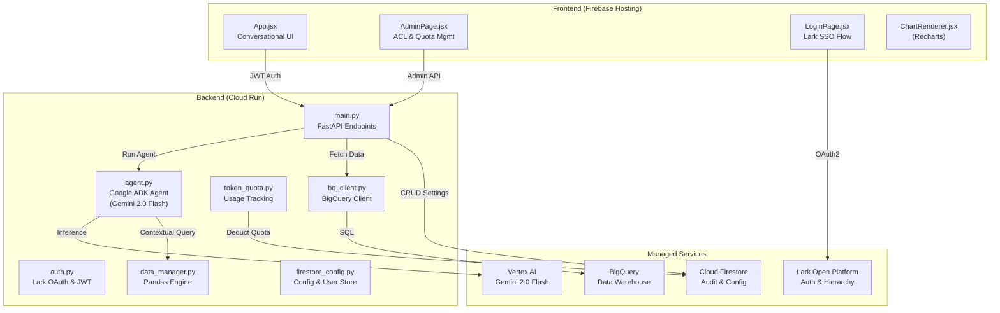

# Prompt-to-Visualization


> **Enterprise-ready AI data visualization generator** — Securely ask questions about your business data in natural language and get interactive charts with AI insights. Powered by Gemini 2.0 Flash, BigQuery, and Firestore.

---

## Summary

Prompt-to-Visualization is an internal tool that enables business users to generate data visualizations from BigQuery data warehouses using natural language prompts. It features **Lark SSO authentication**, **per-user token quotas**, and a granular **Admin Dashboard** for data access control.

The system uses a **Google ADK agent** (Gemini 2.0 Flash) that autonomously inspects schemas, processes data, and returns structured chart configurations. It now supports **stateful conversations**, allowing users to ask follow-up questions and refine visualizations in real-time.

---

## Goals

| # | Goal | Description |
|---|------|-------------|
| 1 | **Democratize data access** | Allow non-technical users to explore BigQuery data without writing SQL. |
| 2 | **Secure Multi-tenancy** | Authenticate via Lark SSO and enforce row-level/table-level access. |
| 3 | **Token Management** | Monitor and limit AI token usage via a per-user daily quota system. |
| 4 | **Conversational Analysis** | Stateful agent that remembers context for deeper data exploration. |
| 5 | **Administrative Control** | Full Admin UI for managing users, departments, and datamart visibility. |

---

## Architecture


```mermaid
flowchart TD
    subgraph Frontend ["Frontend (Firebase Hosting)"]
        UI["App.jsx<br>Conversational UI"]
        ADM["AdminPage.jsx<br>ACL & Quota Mgmt"]
        LGN["LoginPage.jsx<br>Lark SSO Flow"]
        CR["ChartRenderer.jsx<br>(Recharts)"]
    end

    subgraph Backend ["Backend (Cloud Run)"]
        API["main.py <br> FastAPI Endpoints"]
        ATH["auth.py<br>Lark OAuth & JWT"]
        AGENT["agent.py<br>Google ADK Agent<br>(Gemini 2.0 Flash)"]
        DM["data_manager.py<br>Pandas Engine"]
        FS["firestore_config.py<br>Config & User Store"]
        TQ["token_quota.py<br>Usage Tracking"]
        BQ["bq_client.py<br>BigQuery Client"]
    end

    subgraph External ["Managed Services"]
        LARK["Lark Open Platform<br>Auth & Hierarchy"]
        FS_DB["Cloud Firestore<br>Audit & Config"]
        BQW["BigQuery<br>Data Warehouse"]
        VERTEX["Vertex AI<br>Gemini 2.0 Flash"]
    end

    UI -- "JWT Auth" --> API
    ADM -- "Admin API" --> API
    LGN -- "OAuth2" --> LARK
    API -- "CRUD Settings" --> FS_DB
    API -- "Fetch Data" --> BQ
    BQ -- "SQL" --> BQW
    API -- "Run Agent" --> AGENT
    AGENT -- "Contextual Query" --> DM
    AGENT -- "Inference" --> VERTEX
    TQ -- "Deduct Quota" --> FS_DB
```

---

## Application Flow

1.  **Authentication**: User logs in via Lark SSO. A JWT session is established and stored in the browser.
2.  **Datamart Selection**: User selects a Company (Dataset) and Table. The list of tables is filtered based on the user's Firestore-managed access list.
3.  **Visualization Request**: User enters a prompt. The frontend sends the prompt along with the conversation history (for statefulness).
4.  **Backend Execution**:
    -   Verify's user registration and remaining daily token quota.
    -   Pre-fetches table data from BigQuery into an in-memory Pandas store.
    -   Runs the ADK agent with schema context and history.
    -   Agent generates a Pandas expression, executes it, and formats the response.
5.  **Quota Consumption**: Total tokens used are deducted from the user's daily limit in Firestore.
6.  **Rendering**: Frontend displays the chart, AI insight, and updated token usage.

---

## Admin Dashboard

The `/admin` route provides tools for platform administrators:

-   **User Management**: Register users from the Lark organization, assign departments, and set custom daily token limits.
-   **Organization Sync**: Automatically fetch the Lark department hierarchy for easy bulk management.
-   **Datamart ACL**: Enable/disable specific BigQuery tables (datamarts) and control which users can view them.
-   **Usage Monitoring**: Real-time tracking of token usage across the organization.

---

## Tech Stack

| Layer | Technology | Purpose |
|-------|-----------|---------|
| **Frontend** | React 18 + Vite | Modern, responsive UI |
| **Auth** | Lark SSO (OAuth2) | Enterprise identity management |
| **Database** | Cloud Firestore | Persistent configuration, users, and ACLs |
| **AI Agent** | Google ADK + Gemini 2.0 Flash | Natural language processing and tool use |
| **Charts** | Recharts | Interactive data visualization |
| **Backend** | FastAPI | High-performance Python REST API |
| **Data Engine** | Pandas | In-memory data aggregation and filtering |
| **Deployment** | Firebase Hosting + Cloud Run | Scalable serverless architecture |

---

## Project Structure

```
Prompt-to-Visualization/
├── backend/
│   ├── main.py              # FastAPI entry point & routers
│   ├── agent.py             # ADK agent & data tools
│   ├── auth.py              # Lark SSO & JWT sessions
│   ├── firestore_config.py  # Firestore CRUD operations
│   ├── token_quota.py       # Quota logic & Firestore integration
│   ├── data_manager.py      # Pandas in-memory store
│   ├── bq_client.py         # BigQuery wrapper
│   ├── lark_contacts.py     # Lark Org/User synchronization
│   └── models.py            # Pydantic schemas
│
├── frontend/
│   ├── src/
│   │   ├── components/
│   │   │   ├── AdminPage.jsx     # Full Admin Dashboard UI
│   │   │   ├── LoginPage.jsx     # SSO Landing Page
│   │   │   └── ChartRenderer.jsx # Visualization engine
│   │   ├── App.jsx               # Main Conversational UI
│   │   └── services/
│   │       └── api.js            # Unified API service layer
│
└── infrastructure/           # Deployment scripts (Optional)
```

---

## Environment Variables

Create a `backend/.env` file:

```env
# GCP Settings
GOOGLE_CLOUD_PROJECT=your-project-id
BIGQUERY_LOCATION=asia-southeast2

# Lark SSO Configuration
LARK_CLIENT_ID=your-lark-app-id
LARK_CLIENT_SECRET=your-lark-app-secret
LARK_REDIRECT_URI=https://your-api.com/api/auth/callback
SESSION_SECRET_KEY=your-jwt-secret

# URLs
FRONTEND_URL=https://your-app.web.app
```

---

## Utility Scripts

The project includes several CLI tools for maintenance:

| Script | Purpose |
|--------|---------|
| `seed_firestore.py` | Initializes Firestore with default settings and admin users. |
| `auto_grant_access.py` | Bulk grant access to specific departments (e.g., SCM) across all datamarts. |
| `test_vis.py` | Local CLI test for the visualization agent without the frontend. |

---

## In Scope

-   ✅ **Secure Auth**: Lark SSO integration required for all actions.
-   ✅ **Stateful Agents**: Memory-aware Gemini agent for multi-turn exploration.
-   ✅ **Admin Controls**: UI for user, quota, and datamart management.
-   ✅ **Live Monitoring**: Token usage tracking and real-time quota deduction.
-   ✅ **Responsive Design**: Works across desktop, tablet, and mobile (Sidebar-optimized).
-   ✅ **Flexible Data**: Dynamic BigQuery dataset selection (PIS, IGR, Kingpack).

---

## Limitations

-   **Memory Constraints**: Backend processes data in-memory (Pandas); large tables are sampled or limited (typically 100k rows).
-   **Single-Turn Quota**: Quotas reset daily; no rollover for unused tokens.
-   **Join Limits**: Current agent is optimized for single-table queries. JOIN logic is experimental.

---

## License

Internal use only — property of PT Porto Indonesia Sejahtera.
